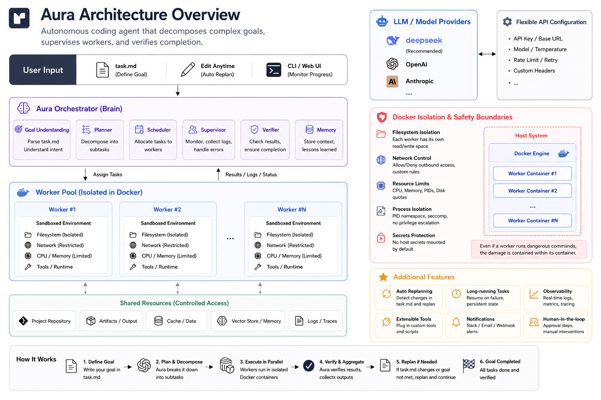

# Aura Agent

**Aura** is an autonomous task orchestrator that decomposes complex goals, manages Layer 2 workers, and verifies task completion. It supports secure Docker-based execution, flexible API configuration, and integrates with multiple backend models like `deepseek-v4-pro`, `Claude Code`, `ds_code`, and `OpenCode`.

---

## Architecture



---

## Docker Isolation (Optional)

When enabled, Aura runs Layer 2 workers in Docker:

* Each worker runs in a separate container with a clean `/workspace`.
* Non-root user prevents host file or system access.
* Resource limits (CPU, memory, GPU) ensure rogue processes stay contained.
* Pre-built image automatically pulled from GHCR.

Configuration in `.env` or via `aura setup`:

```text
AURA_WORKERS_IN_DOCKER=1
AURA_DOCKER_BIN=docker
AURA_DOCKER_GPUS=all
AURA_DOCKER_EXTRA_ARGS=
AURA_DOCKER_CLAUDE_API_KEY=<your-key>
AURA_DOCKER_CLAUDE_BASE_URL=<base-url>
AURA_DOCKER_CLAUDE_MODEL=deepseek-v4-pro
```

---

## Quick Start (Under 2 Minutes)

```bash
git clone https://github.com/erickong/aura-agent
cd aura-agent
pip install -e .

# Run interactive setup to configure API keys and models
aura setup

# Go to your project
cd /path/to/your/project

# create your take file(task.md for example), describe your goal.
# Aura your goal
aura task.md

# Aura watches task.md and replans automatically.
```

Edit `task.md` anytime while Aura is running. The agent detects changes, replans, and continues work automatically. Then you can step away and let it operate.

---

## Comparison with Other Agents

| Feature                    | Aura | Generic AI Agent | AutoGPT     |
| -------------------------- | ---- | ---------------- | ----------- |
| Layer 2 Workers            | ✔    | ✖                | ✖           |
| Docker Isolation           | ✔    | ✖                | ✖           |
| Flexible API Backend       | ✔    | ✖                | ✔ (limited) |
| Continuous Replanning      | ✔    | ✖                | ✔           |
| Long-Term Memory           | ✔    | ✖                | ✔           |
| Complex Task Decomposition | ✔    | ✖                | ✔           |

---

## Example Use Cases

* Build a quantitative trading pipeline from scratch, testing multiple models until target Sharpe ratio is achieved.
* Generate research reports, whitepapers, or documentation automatically.
* Automate repetitive coding or data processing tasks with minimal supervision.

---

## Topics / Tags (GitHub)

`ai-agents`, `coding-agent`, `deepseek`, `docker`, `autonomous-agents`, `Claude`, `OpenCode`, `ds_code`

---

